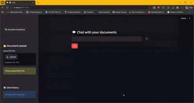
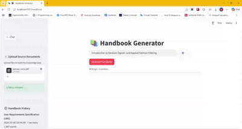

# 🤖 AI Assistant — RAG-Powered Document Chat & Handbook Generator

A Streamlit application that turns your PDF documents into an interactive knowledge base. Ask questions and get context-aware answers, or generate complete, professionally formatted handbooks on any topic — all powered by a local Retrieval-Augmented Generation (RAG) pipeline built on Ollama, ChromaDB, and LangChain.

---

## ✨ What It Does

The AI Assistant lets you upload one or more PDF files, which are parsed, chunked, embedded, and stored in a local vector database. From there, you get two distinct tools:

1. **💬 Document Chat** — Have a conversation with your documents. The app retrieves the most relevant passages for each question and generates a grounded answer, streamed live.
2. **📚 Handbook Generator** — Provide a topic and the app plans a full outline, writes each section using your uploaded source material, compiles a table of contents, and exports the finished document as a PDF.

Everything runs against a local Ollama instance, so your documents never leave your machine.

---

## 🎬 Examples & Demos

### 💬 Demo — Chat with Your Documents

Ask questions about uploaded PDFs and receive context-aware answers.



[▶ Watch the full chatbot demo (MP4)](Examples/Chatbot.mp4)

---

### 📚 Demo — Handbook Generation

Generate a structured handbook on *Introduction to Random Signals and Applied Kalman Filtering*.



[▶ Watch the full handbook generation demo (MP4)](Examples/Introduction_to_Random_Signals_and_Applied_Kalman_Filtering.mp4)

---

### 📄 Sample Handbook Output

A complete handbook generated by the application and exported as a PDF.

[📖 **Open the generated handbook (PDF)**](Examples/Introduction_to_Random_Signals_and_Applied_Kalman_Filtering_Handbook.pdf)

---


## 🚀 Features

### 💬 Chat with Your Documents
- **Retrieval-Augmented answers** — Each question is matched against the top-k most relevant chunks from your uploaded PDFs, and the model is instructed to answer *only* from that context.
- **Live token streaming** — Responses appear word-by-word as they are generated.
- **Conversation management** — Start new chats with the ➕ button and revisit past conversations from the sidebar.
- **Duplicate-question guard** — Prevents accidentally re-asking the same question in a session.
- **Separate chat knowledge base** — Chat uploads are indexed independently from handbook sources.

### 📚 Handbook Generator
- **Topic-driven generation** — Enter a topic (e.g. "Workplace Safety") and the app takes it from there.
- **Automatic outline planning** — The model produces a structured, numbered plan of 3–10 sections, each with a title and a stated main point.
- **Section-by-section streaming** — Watch progress in real time with a progress bar and a live Markdown preview as each section completes.
- **Context continuity** — Each section is written with awareness of the previous one, avoiding repetition and keeping the narrative coherent.
- **Table of contents & title page** — The final document is compiled with a proper title block and TOC.
- **PDF export** — Finished handbooks are rendered to a styled PDF (Unicode-safe DejaVu fonts, Markdown stripping, semantic headings) and offered as a one-click download.
- **Generation history** — Every handbook is logged with topic, timestamp, section count, word count, and PDF path, viewable in the sidebar.

### 📂 Document Management
- **Multi-file PDF upload** — Process several documents at once.
- **Smart duplicate detection** — Uploaded files are fingerprinted by name and size so the same batch isn't reprocessed.
- **Content-addressed chunk IDs** — Chunks are keyed by source, page, and index, so re-uploading overlapping documents won't create duplicates in the vector store.
- **Knowledge base reset** — A single button clears a collection and invalidates all cached database handles.

### 🧠 Architecture & Technical Highlights
- **Fully local inference** — Uses `phi3` via `ChatOllama` for generation and `nomic-embed-text` for embeddings.
- **ChromaDB vector store** — Persistent, file-backed storage with separate collections for chat and handbook workflows.
- **Cached resources** — Models, embeddings, text splitters, and DB handles are memoized with `lru_cache` and Streamlit's `cache_resource` for speed.
- **Safe resets on Windows** — Collections are cleared by deleting data rather than files, avoiding file-locking errors.
- **Robust plan parsing** — A tolerant regex parser handles minor LLM formatting deviations, with a raw-line fallback if structured parsing fails entirely.
- **Clean Streamlit navigation** — Custom page switching between Chat, Handbook, and Home, with the default sidebar nav hidden.

---

## 🗂️ Project Structure

```
AI-powered_Handbook_Generator_and_Chat_Application/
├── app.py                        # Landing page with navigation
├── pages/
│   ├── chat.py                   # Streamlit chat interface
│   └── handbook.py               # Streamlit handbook generator UI
├── Examples/                      # Example media (demos + sample handbook)
│   ├── Introduction_to_Random_Signals_and_Applied_Kalman_Filtering_Handbook.pdf
│   ├── Introduction_to_Random_Signals_and_Applied_Kalman_Filtering.mp4
│   ├── Introduction to Random Signals and Applied Kalman Filtering.pdf
│   ├── URS.pdf
│   ├── URS_Handbook.pdf
│   └── Chatbot.mp4
├── rag_pipeline.py               # Core RAG: embeddings, chunking, Chroma, chat streaming
├── handbook_generator.py         # Planning, section streaming, compilation
├── handbook_export.py            # PDF rendering (FPDF) + generation history
├── chroma_manager.py             # Collection reset helpers
├── pdf_processor.py              # Page-by-page PDF text extraction
├── License
├── requirements.txt
├── .gitignore
├── dejavu_sans.zip
├── dejavu_sans_condensed-bold.zip
└── README.md
```

### Module Reference

| File | Purpose |
|------|---------|
| `app.py` | Landing page with navigation to Chat and Handbook Generator |
| `pages/chat.py` | Streamlit chat interface, uploads, history, and reset controls |
| `pages/handbook.py` | Streamlit handbook UI — topic input, generation progress, PDF download |
| `rag_pipeline.py` | Core RAG logic: embeddings, chunking, Chroma storage, and chat streaming |
| `handbook_generator.py` | Planning, section streaming, compilation, and the main generation pipeline |
| `handbook_export.py` | PDF rendering (FPDF) and JSON-based generation history |
| `chroma_manager.py` | Collection reset helpers for both knowledge bases |
| `pdf_processor.py` | Page-by-page PDF text extraction with pdfplumber |
| `results/` | Demo videos and a sample generated handbook PDF |

---

## 🛠️ Requirements

- **Python 3.10+**
- **Ollama** running locally, with the following models pulled:
  - `phi3` (chat/generation)
  - `nomic-embed-text` (embeddings)
- **Python packages:** `streamlit`, `langchain-ollama`, `langchain-chroma`, `langchain-text-splitters`, `langchain-core`, `chromadb`, `pdfplumber`, `fpdf2`

---

## 🏁 Getting Started

1. **Install and start Ollama**, then pull the required models:
   ```bash
   ollama pull phi3
   ollama pull nomic-embed-text
   ```

2. **Install Python dependencies:**
   ```bash
   pip install streamlit langchain-ollama langchain-chroma langchain-text-splitters langchain-core chromadb pdfplumber fpdf2
   ```

3. **Run the app:**
   ```bash
   streamlit run app.py
   ```

4. **Upload PDFs** in the sidebar of either page, then start chatting or generating.

---

## 💡 Example Workflows

**Research assistant:** Upload a stack of papers and ask targeted questions like *"What methodology did the authors use?"* or *"Summarize the key findings."*

**Onboarding handbook:** Upload your company policy documents, enter "New Employee Onboarding", and receive a structured PDF handbook with sections on culture, safety, tools, and procedures.

**Study guide:** Upload course readings and generate a handbook on a specific exam topic, complete with a table of contents you can print.

> See the [**Examples & Demos**](#-examples--demos) section above for a real handbook generated on *Introduction to Random Signals and Applied Kalman Filtering*.

---

## 📝 Notes & Limitations

- Answers are grounded strictly in the retrieved context; if your documents don't cover a topic, the model may respond that it lacks the information.
- Generation quality depends on the size and relevance of your uploaded source material.
- The `phi3` model is lightweight and fast but may produce less polished prose than larger models — swap `CHAT_MODEL` in `handbook_generator.py` and `rag_pipeline.py` if you have more compute available.
- All data (vector stores, PDFs, history) is stored locally in `chroma_chat/`, `chroma_handbook/`, and `output/`.
